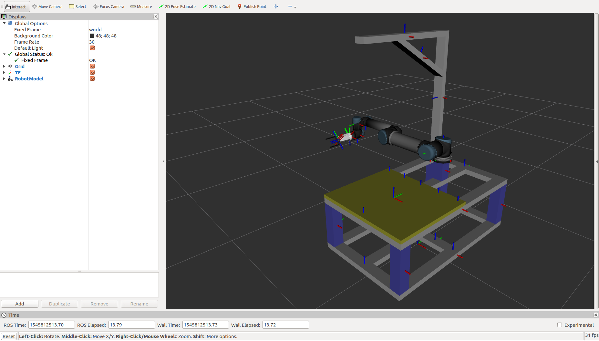

================
Getting Started
================

3.1 Install universal_robot and ur_description package:
--------------------------------------------------------

::

  sudo apt-get install ros-kinetic-universal-robot
  sudo apt-get install ros-kinetic-ur-description

3.2 Setup the handson code:
-----------------------------

If you made binary installation in the last section, create a catkin workspace for handson at first: ::

  mkdir -p ~/ws_handson/src

Download and build the moveit_handson code: ::

  cd ~/ws_handson/src
  git clone https://github.com/RoboticsYY/moveit_handson.git
  cd ..
  catkin_make -DCMAKE_BUILD_TYPE=Release
  source devel/setup.bash

You can check the installation by run: ::

  roslaunch handson_description visualize_ur5.launch

If everything works fine, you can see the following screen.

If you have installed the MoveIt! by source, you can skip this step. Download and build the handson moveit packages: ::

  cd ~/ws_handson/src
  git clone https://github.com/RoboticsYY/moveit_core_handson.git
  git clone https://github.com/RoboticsYY/moveit_ros_handson.git
  cd ..
  catkin_make

The build gonna continue for a few minutes…… ::

  source devel/setup.bash

