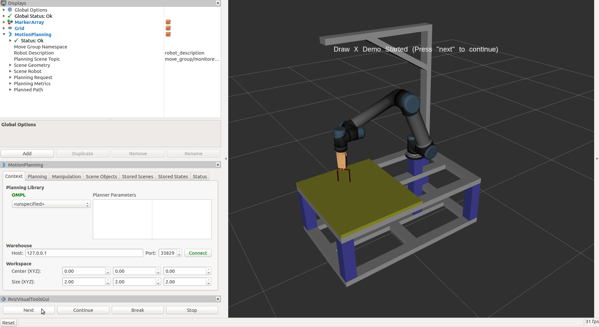

=================================
3. Motion Planning and Execution
=================================

Bring up MoveIt! motion planning pipeline in one shell. 
Remember to source the workspace before executing the command: ::

  roslaunch handson_moveit_config demo.launch

.. note:: This command is executed from the config package just created, 
          if you meet error in this section, you can replace the above command 
          by the following command to see the result: ::
  
            roslaunch ur5_hitbot_ilc_platform_moveit_config demo.launch

In another shell, run the demo that makes UR5 end-effector to draw letter “X”: ::

  roslaunch handson_example draw_x.launch

Press the ``Next`` button on the **RvizVisualToolsGui** to start the demo

