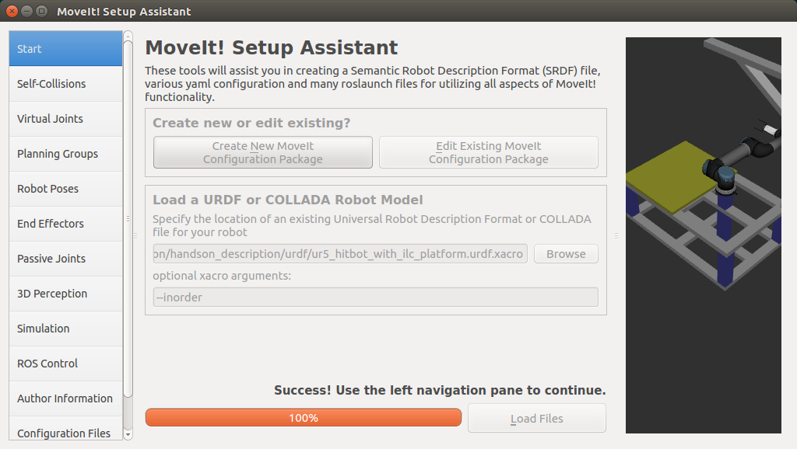
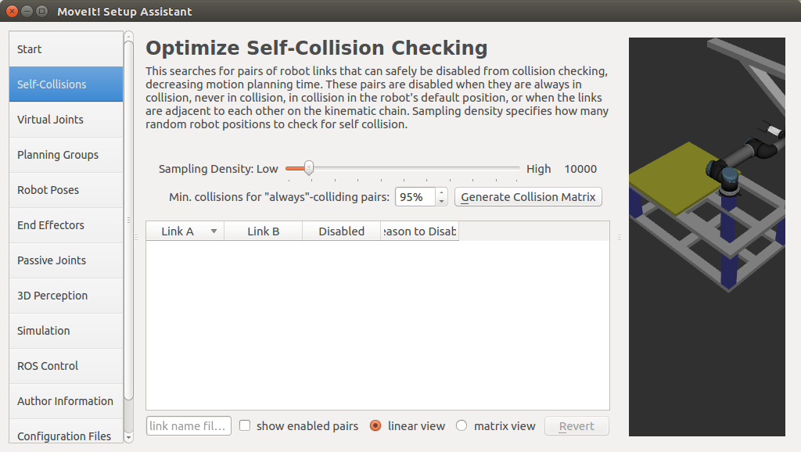
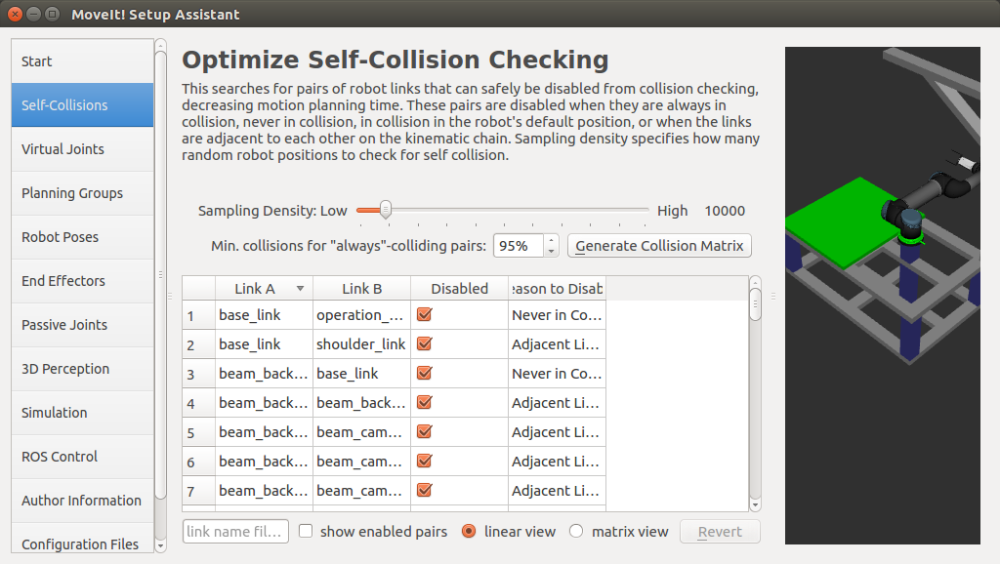
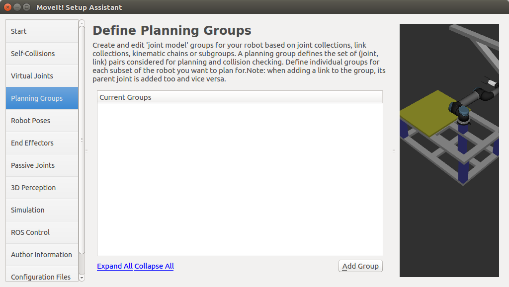
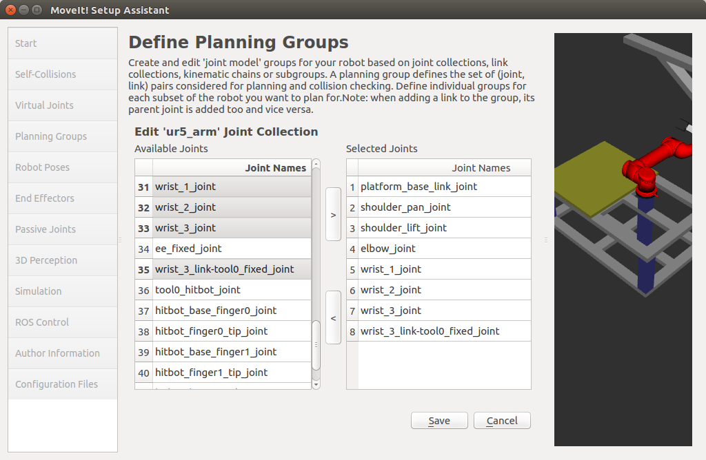
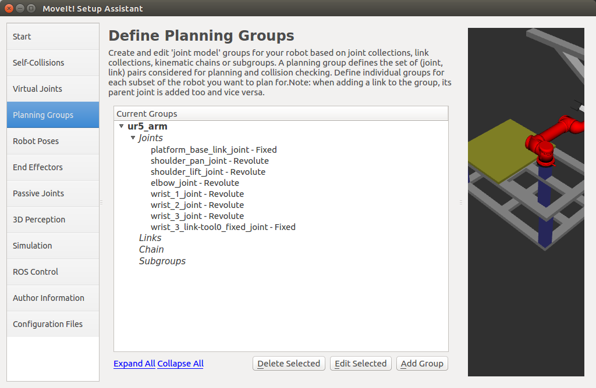
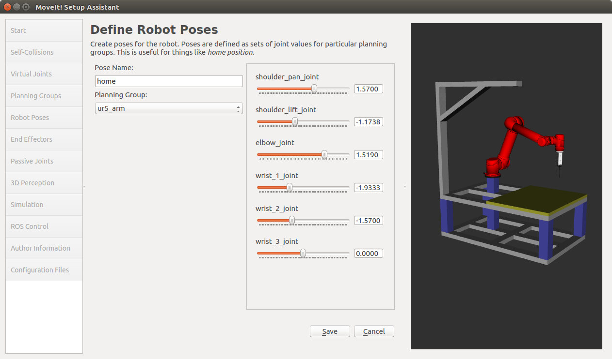
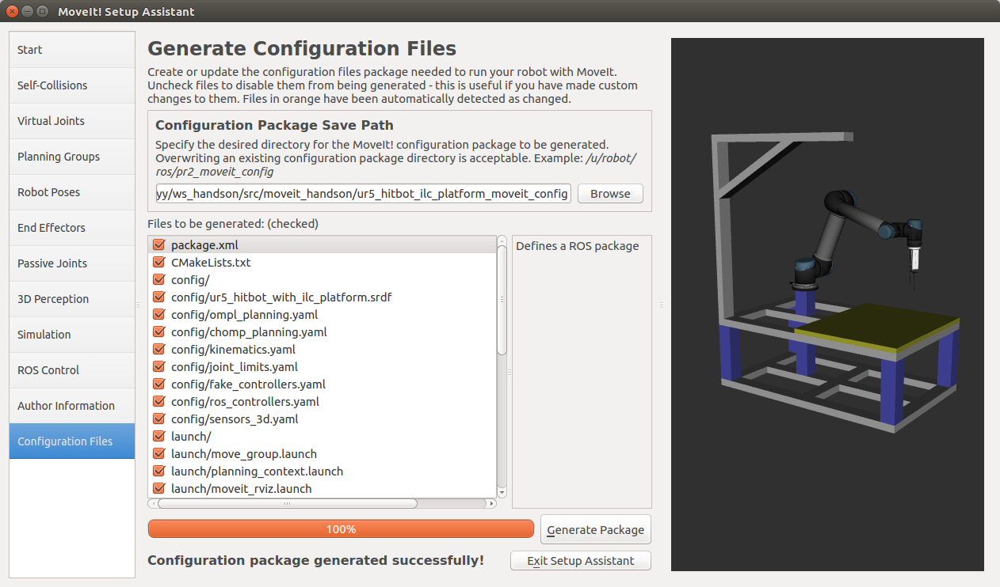

=================
MoveIt! Congiure
=================

If you have the ``ur5_hitbot_ilc_platform_moveit_config`` package already git-cloned from the Getting Started section, 
be sure to delete that now since this handson will show you how to create it from scratch: ::

  cd ~/ws_handson/src
  rm -rf ur5_hitbot_ilc_platform_moveit_config
  catkin clean ur5_hitbot_ilc_platform_moveit_config

4.1 Start MoveIt! Setup Assistant:
-------------------------------------

::

  cd ~/ws_handson
  roslaunch moveit_setup_assistant setup_assistant.launch

4.2 Create new MoveIt! config package:
----------------------------------------

Click on the ``Create New MoveIt! Configuration Package`` button to bring up the following screen:

.. image:: ../_static/start_screen.png

4.3 Load urdf file:
--------------------
Click on the ``browse`` button and navigate to the ``ur5_hitbot_with_ilc_platform.urdf.xacro`` file installed 
when you installed the ``moveit_handson`` package above. (If you have followed the previous steps, 
this file gets installed in
``~/ws_moveit/src/moveit_handson/handson_description/urdf/ur5_hitbot_with_ilc_platform.urdf.xacro``.) 
Choose that file and then click ``Load Files``. The Setup Assistant will load the files (this might take a few seconds) 
and present you with this screen:

4.4 Generate self-collision matrix:
------------------------------------

Click on the ``Self-Collisions`` pane selector on the left-hand side and click on the ``Generate Collision Matrix`` button. 
The Setup Assistant will work for a few second before presenting you the results of its computation in the main table.

4.5 Virtual joints:
--------------------

Virtual joints are used primarily to attach the robot to the world. 
Since the UR5 robot is already attached to the platform and the platform 
is attached to the world in the loaded urdf file, there is no need to add virtual joints.

4.6 Add planning groups:
--------------------------

* Click on the ``Planning-Groups`` panel selector:

* Click on ``Add Group`` button to add arm group:

.. image:: ../_static/planning_groups_1.png

* We will first add UR5 arm as a planning group:

  - Enter ``Group Name`` as “ur5_arm”
  - Choose ``kdl_kinematics_plugin/KDLKinematicsPlugin`` as the kinematics solver.
  - Let ``Kin. Search Resolution`` and ``Kin. Search Timeout`` stay at their default values.

* Now, click on the ``Add Joints`` button:

  - Choose “platform_base_link_joint”, “shoulder_pan_joint”, “shoulder_lift_joint”, “elbow_joint”, 
    “wrist_1_joint”, “wrist_2_joint”, “wrist_3_joint” and “wrist_3_link-tool0_fixed_joint” 
    from the left ``Available Joints`` list. Add them to the right ``Selected Joints`` list. 
    Click ``Save`` button to save the selected group:

* Now, the screen should be like this:

* Click ``Add Group`` button again to add the end-effector group. 

  - .. note:: you will do this using a different procedure than adding the arm
          
  - Enter ``Group Name`` as “hand”
  - Let ``Kin. Search Resolution`` and ``Kin. Search Timeout`` stay at their default values.

    .. image:: ../_static/planning_groups_4.png

  - Click on the ``Add Links`` button.
  - Choose “hitbot_base”, “hitbot_mask”, “hitbot_finger0”, “hitbot_finger0_tip”, 
    “hitbot_finger1” and “hitbot_finger1_tip”, and add them to the list of ``Selected Links`` on the right hand side.
  - Click ``Save``

    .. image:: ../_static/planning_groups_5.png

  - Finally, it would be like this:

    .. image:: ../_static/planning_groups_6.png    

4.7 Add robot poses:
---------------------

* Click on the ``Robot Poses`` panel
* Click ``Add Pose`` button
* Set “home” as ``Pose Name``
* Choose “ur5_arm” as ``Planning Group``

  - Set “shoulder_pan_joint” as “1.57”
  - Set “shoulder_lift_joint” as “-1.1738”
  - Set “elbow_joint” as “1.5190”
  - Set “wrist_1_joint” as “-1.9333”
  - Set “wrist_2_joint” as “-1.57”
  - Set “wrist_3_joint” as “0.0”

* Click ``Save`` button to save the pose

4.8 Label end-effectors:
--------------------------

* Click on the ``End Effectors`` panel.
* Click ``Add End Effector``.
* Choose “hand” as the ``End Effector Name`` for the gripper.
* Select “hand” as the ``End Effector Group``.
* Select “tool0” as the ``Parent Link`` for this end-effector.
* Leave ``Parent Group`` blank.
* Click ``Save``. 

4.9 Passive joints:
--------------------

The passive joints are the unactuated joints of the robot, 
since UR5 doesn’t have such kind of joints, so the ``Passive Joints`` panel will be skipped.

4.10 3D perception:
--------------------

The ``3D Perception`` is used to config the parameters of octomap by using a 3D sensor, 
such as RGBD cameras, stereo cameras or laser scanners. In this handson, we will skip this.

4.11 Gazebo simulation:
------------------------

The ``Simulation`` will add necessary tags in the urdf file, 
so that the physics of the robot will be simulated in Gazebo. 
Since we have already added these tags manually, so this step can be skipped.

4.12 ROS control:
------------------

You can also skip the ``ROS Control`` panel, because we will config the file manually later.

4.13 Author information:
-------------------------

Click on the ``Author Information`` panel. Enter your name and email address.

4.14 Generate configuration files:
-----------------------------------

* Click on the Configuration Files panel.
* In the ``Configuration Package Save Path``, 
  browse to the file location **/src/moveit_handson/**, 
  and input **ur5_hitbot_ilc_platform_moveit_config** as your package name. 
* Click on the ``Generate Package button``.
* Click ``Exit Setup Assistant``. 
  Find your moveit config package in **/src/moveit_handson/ur5_hitbot_ilc_platform_moveit_config**.

4.15 Set initial pose to fake_controllers.yaml
------------------------------------------------

Set “home” pose as the initial pose for the simulation:
Open **ur5_hitbot_ilc_platform_moveit_config/config/fake_controllers.yaml** with any editor, 
add the following lines to the end of the file, save and close: ::

  initial:
  - group: ur5_arm
    pose:  home

4.16 Add RvizVisualToolsGui:
------------------------------

Open **ur5_hitbot_ilc_platform_moveit_config/launch/moveit.rviz**, 
add **RvizVisualToolsGui** to the subitems of ``Panels``, so that it would look like: ::

  Panels:
    - Class: rviz/Displays
      Help Height: 84
      Name: Displays
      Property Tree Widget:
        Expanded: ~
        Splitter Ratio: 0.742560029
      Tree Height: 330
    - Class: rviz/Help
      Name: Help
    - Class: rviz/Views
      Expanded:
        - /Current View1
      Name: Views
      Splitter Ratio: 0.5
    - Class: rviz_visual_tools/RvizVisualToolsGui
      Name: RvizVisualToolsGui

